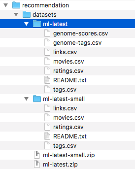

# Building a Recommendation System in PySpark - Lab

## Introduction

In this last lab, we will implement a a movie recommendation system using ALS in Spark programming environment. Spark's machine learning libraray `Mllib` comes packaged with a very efficient imeplementation of ALS algorithm that we looked at in our previous lesson. The lab will require you to put into pratice your spark programming skills for creating and manipulating RDDs. We will go through a step-by-step process into developing a movie recommendation system using a larger subset of the MovieLens dataset than the one we used in previous lab.

Note: You are advised to refer to [PySpark Documentation](http://spark.apache.org/docs/2.2.0/api/python/index.html) heavily for completing this lab as it will introduce a few new methods. 


## Objectives

You will be able to:

* Demonsrate an understanding on how recommendation systems are being used for personalization of online services/products
* Parse and filter datasets into Spark RDDs, performing basic feature selection
* Run a brief hyper-parameter selction activity through a scalable grid search
* Train and evaluate the predictive performance of recommendation system
* Generate predictions from the trained model


## Building a Recommendation System


We have seen how recommender/Recommendation Systems have played an  integral parts in the success of Amazon (Books, Items), Pandora/Spotify (Music), Google (News, Search), YouTube (Videos) etc.  For Amazon these systems bring more than 30% of their total revenues. For Netflix service, 75% of movies that people watch are based on some sort of recommendation.

> The goal of Recommendation Systems is to find what is likely to be of interest to the user. This enables organizations to offer a high level of personalization and customer tailored services.


For online video content services like Netflix and Hulu, the need to build robust movie recommendation systems is extremely important. An example of recommendation system is such as this:

1.    User A watches Game of Thrones and Breaking Bad.
2.    User B performs a search query for Game of Thrones.
3.    The system suggests Breaking Bad to user B from data collected about user A.
    


This lab will guide you through a step-by-step process into developing such a movie recommendation system. We shall use the MovieLens dataset to build a movie recommendation system using collaborative filtering technique with Spark's Alternating Least Saqures implementation.

## Stage 1: Data Acquisition and Pre-processing

### MovieLens Ratings Dataset

Previously we used the 1 million ratings dataset for applying simple SVD in python. 

For our experiment , we shall use the latest datasets. Grouplens offer the complete ratings dataset and a smaller subset for hyper parameter optmization and model selection. 

* **Complete Dataset**: 26,000,000 ratings applied to 45,000 movies by 270,000 users. Last updated 8/2017.
* **Small Dataset**: 100,000 ratings applied to 9,000 movies by 700 users. Last updated 10/2016.

Both these datasets are available in this repo. 

For this lab, we will use the small dataset `datasets/ms-latest-small/`. The main reason for using this dataset is to speed up computation and focus more on the pyspark programming. You are required to re run the experiment using the larger dataset in `dataset/ml-latest`.

* Create a folder `datasets` in your pyspark environment. 
* Paste the provided ofiles in their respective directories as shown below
* We will also keep the complete dataset for later experimentation.



Let's also import PySpark to our Python environment and and initiate a local SparkContext `sc`.


```python
import pyspark
sc = pyspark.SparkContext('local[*]') # [*] represents a local context i.e. no cluster
```

### Dataset Selection, Parsing and Filtering

With our SparkContext initialized, and our dataset in an accessible locations, we can now parse the csv files and read them into RDDs. The small dataset contains a number of csv file with features as shown below:  

- ratings.csv :**UserID, MovieID, Rating, Timestamp**

- movies.csv :**MovieID, Title, Genres > *Genre1|Genre2|Genre3...**

- tags.csv :**UserID, MovieID, Tag, Timestamp**

- links.csv :**MovieID, ImdbID, TmdbID**

We shall focus on `ratings.csv`, and `movies.csv` from small dataset here for building our recommendation system. Other features can be incorporated later for improving the predictive performance of the system.  The format of these files is uniform and simple and such comma delimited files can be easily parsed line by line using Python `split()` once they are loaded as RDDs. 

Let's parse `ratings.csv` and `movies.csv` files into two RDDs. We also need to filter out the header row in each file containing column names. 

- For each line in the `ratings.csv`, create a tuple of (UserID, MovieID, Rating). Drop the Timestamp feature. 
- For each line in the `movies.csv`, Create a tuple of (MovieID, Title). Drop the Genres.

Set path variables for `ratings` and `movies` csv files. 


```python
# Create a path for identifying the ratings and movies files in small dataset
ratingsPath = 'datasets/ml-latest-small/ratings.csv'
moviesPath = 'datasets/ml-latest-small/movies.csv'
```

### Parsing `ratings.csv`

- Use `sc.textFile()` to read the raw contents of ratings file into an RDD
- Read the contents of ratings file into an RDD and view its first row (Header containing column names)


```python
# Code here
```


    'userId,movieId,rating,timestamp'


We need to filter some of the data at this stage. We can drop the timestamp feature as we won't use that build recommendations. We will parse the raw ratings data into a new RDD and filter out the header row. Perform following transformations on `ratingsRaw`:

1. Read `ratingsRaw` contents into a new RDD while using `.filter()` to exclude the header information with `ratinsHeader`.
2. Split each line of the csv file using `,` demiliter as the input argument with `split()` function.
3. Collect the first three elements of each row (UserID, MovieID, Rating) and discard fourth (timestep) field. Remember to read ratings as `float`. 
4. Cache the final RDD (Optional) using `RDD.cache()` (optional but help speed up computation with large RDDs).
5. Print the total number of recommendations and view first three rows.


```python
# Code here
```

    There are 100004 recommendations in the  dataset


    [(1, 31, 2.5), (1, 1029, 3.0), (1, 1061, 3.0)]


This looks well in-line with our expectations. Let's do the same for `movies.csv`.

### Parsing `movies.csv`

We shall now proceed in a similar way with `movies.csv` file. Repeat following steps as performed above:

1. Use the path variable for identifying the location of **movies.csv**.
2. Read the text file into RDD.
3. Exclude the header information.
4. Split the line contents of the csv file.
5. Read the contents of resulting RDD creating a (MovieID, Title) tuple and discard genres. 
6. Count number of movies in the final RDD.


```python
# Code here
```

    There are 9125 movies in the complete dataset


    [('1', 'Toy Story (1995)'),
     ('2', 'Jumanji (1995)'),
     ('3', 'Grumpier Old Men (1995)')]


We now have the two RDDs we created above and we shall use these to build and train our recommendation system. 

### Saving Pre-Processed Data (optional)

We can optionally save our preprocessed datasets now or a later stage to avoid reading and re-processing large files repeatedly. Create a folder "pre_processed" and save `movieRDD` and `ratingsRDD` using `RDD.saveAsTExtFile(filename)`. 


```python
# Code here
```

These files can be read back using `sc.textfile()` method that we saw earlier. 

## Stage 2: Alternate Least Squares: Model Training and Evaluation

### Splitting the Data as Testing , Training and Validation Sets. 

We will now split the data for building our recommendation system. We can use spark's `randomsplit()` transformation that uses given weights to split an rdd into any number of sub-RDDs. The standared usage of this transformation function is :

> `RDD.randomSplit(weights, seed)`

**weights** – weights for splits, will be normalized if they don’t sum to 1

**seed** – random seed

Perform following tasks:

- Split the `ratingsRDD` into training, testing and validation RDDs (60%, 20%, 20%) using respective weights.
- Perform a `.count` on resulting datasets to show the count of elements of each RDD. 


```python
# Code here
```


    (60050, 19904, 20050)


For prediction of ratings, we would need `customerID` and `movieID` from validation and test RDDs respectively. 

- Map `customerID` and `movieID` from validation and test RDDs into two new RDDs which will be used for training and validation purpose. 
- Take 3 elements from both RDDs to inspect the results.

For now , we shall ignore the `ratings` values for these RDDs, as these will be predicted later.  


```python
# Code here
```

    Example Validation Features: [(1, 1263), (1, 1343), (1, 1405)]
    Example Test Features: [(1, 1129), (1, 2294), (1, 2968)]


We will use the `validFeaturesRDD` during the training process to avoid the model from overfitting (getting stuck into a local minima) and the `testFeaturesRDD` with trained model to measure its predictive performance. Good old supervised learning. 

### Collaborative Filtering and Alternate Least Squares in Spark

Spark MLlib library for Machine Learning provides a Collaborative Filtering implementation by using Alternating Least Squares (ALS) algorithm.

`spark.mllib` currently supports model-based collaborative filtering, in which users and products are described by a small set of latent factors that can be used to predict missing entries. `spark.mllib` uses the alternating least squares (ALS) algorithm to learn these latent factors. 

We shall work with following hyper-parameters and set their values prior to the actual training process:

* `rank` : Number of hidden/latent factors in the model. **(use the list [2,4,6,8,10] as possible rank values)**
* `iterations` : Number of iterations to run. **(set to 10)**
* `lambda` :  Regularization parameter in ALS.**(set to 0.1)**

Spark offers a lot of other parameters for detailed and indepth fine tuning of the algorithm. Details on spark's ALS implementation can be viewed [HERE](https://spark.apache.org/docs/2.2.0/mllib-collaborative-filtering.html). For now, we will use default values for all the other hyper parameters. 

- Import ALS from `mllib` along with `math` module (for calculating `RMSE`) and set our learning parameters. 
- Import the ALS algorithm and set parameters as shown above. 
- For the initial experiment, use `iterations = 10`, `lambda = 0.1` and run a grid for identifying best value for `rank`.

> **Note**: You may decide to run a larger grid with other model parameters after setting up the codebase.


```python
# Code here
```

### Model Training and Validation with hyper-parameter optimization

We can now start our training process using above parameter values which would include following steps: 

* Run the training for each of the rank values in our `ranks` list inside a for loop.
* Train the model using trainRDD, ranksVal, seed, numIterations and lambdaRegParam value as model parameters. 
* Validate the trained model by predicting ratings for `validFeaturesRDD` using `ALS.predictAll()`.
* Compare predicted ratings to actual ratings by joining generated predictions with `validRDD`. 
* Calculate error as RMSE for each rank. 
* Find the best rank value based on RMSE

For sake of simplicity, we shall repeat training process for changing ranks value **only**. Other values can also be changed as a detailed grid search for improved predictive performance. 


```python
# Code here
```

    For Rank = 2 , the RMSE value is: 0.9492876773915179
    For Rank = 4 , the RMSE value is: 0.94553209880163
    For Rank = 6 , the RMSE value is: 0.9491943433112304
    For Rank = 8 , the RMSE value is: 0.9512400007129131
    For Rank = 10 , the RMSE value is: 0.9563593454968813
    The best model was trained with Rank = 4


### Analyzing the Predictions

- Have a look at the format of predictions the model generated during last validation stage. 


```python
# Code here
```


    [((580, 1084), 3.492776257690668),
     ((302, 1084), 3.078629750519478),
     ((514, 1084), 3.985426769882686)]


The output shows we have the `((UserID,  MovieID), Rating)` tuple, similar to the ratings dataset. The `Ratings` field in the predictions RDD refers to the ratings predicted by the trained ALS model. 

Above code joins these predictions with our validation data
- take 3 elements from the validPlusPreds


```python
# Code here
```


    [((1, 1405), (1.0, 2.7839431097640492)),
     ((2, 296), (4.0, 3.9729953606585244)),
     ((2, 616), (3.0, 3.128218990007167))]


This output shows the format `((UserId, MovieId), Ratings, PredictedRatings)`. 

We calculated the RMSE by taking the squred difference and calculating the mean value as our `error` value.

### Testing the Model

We shall now test the model with test dataset that has been kept away from the learning phase upto this point. 
Use following parameters:

* Use `trainRDD` for training the model.
* Use `bestRank` value learnt during the validation phase.
* Use other parameter values same as above. 
* Generate predictions with `testFeaturesRDD`
* Calculate error between predicted values and ground truth as above.


```python
# Code here
```

    For testing dataset, the calculated RMSE value:  0.9498348141480232


This doesnt look so bad. Remember due to probablistic nature of ALS algorithm, changing the seed value will also show somen fluctuations in RMSE. 

## Stage 3: Making Recommendations

For making recommendations using collaborative filtering, we re-train the model including the new user preferences in order to compare them with other users in the dataset. In simple terms, the system needs to be trained every time we have new user ratings. Once we have our model trained, we can reuse it to obtain top recomendations for a given user or an individual rating for a particular movie. 

First we need to count the number of ratings per movie. We can create a function that inputs the movies RDD created earlier  and calculates total number of ratings. Based on this, we can later define a threshold ratings value to only include movies with a minimum count of ratings. 

Create a function `getRatingCount()` to do following:

* Input the ratings RDD (grouped by movies)
* Count the total number of rating for a given movie ID
* Return the movie id and total number of ratings as a tuple. 


Perform following tasks in the given sequence: 

* Use `ratingsRDD` to get movie ID and ratings values, and `groupby()` movie ID to group all ratings for each movie
* Pass the new RDD to the function above to count the number of ratings for all movies
* create a new RDD `movieRatingsCountsRDD` to carry movie rating and count as a tuple
* take 5 elements for inspection


```python
# Code here
```


    [(1172, 46), (2150, 36), (2294, 53), (2968, 43), (10, 122)]


### Adding New User(s) and Rating(s)

In order to make recommendations, we now need to create a new user and generate some initial set of ratings for collaborative filtering to work. First let's create a new user with a unique id , say 0, as its not currently used and would be easily identifiable later. 


```python
newUserID = 0
```

Now we need to rate some movies under this user. You are encouraged to look into movies RDD to set some ratings for the movies based on your own preferences. That would give you a good chance to qualitatively assess the the outcome for this system. 

For this experiment, lets create some rating values for our new user who likes comedy, family and romantic movies. You can add or omit other ratings too. 

    18	    Four Rooms (1995)	Comedy
    60074	Hancock (2008)	Action|Adventure|Comedy|Crime|Fantasy
    19	    Ace Ventura: When Nature Calls (1995)	Comedy
    203	    To Wong Foo, Thanks for Everything! Julie Newmar (1995)	Comedy
    205	    Unstrung Heroes (1995)	Comedy|Drama
    8784	Garden State (2004)	Comedy|Drama|Romance
    55830	Be Kind Rewind (2008)	Comedy
    56176	Alvin and the Chipmunks (2007)	Children|Comedy
    63393	Camp Rock (2008)	Comedy|Musical|Romance
    64622	Reader, The (2008)	Drama|Romance
    65088	Bedtime Stories (2008)	Adventure|Children|Comedy
    78499	Toy Story 3 (2010)	Adventure|Animation|Children|Comedy|Fantasy|IMAX

We will put these ratings in a new RDD use the user ID = -1 to create a (userID, movieID, rating) tuple.


```python
# Based on above, create an RDD containing (userID, movieID, rating) tuple
newUserRating = [(0,18,4),
                 (0,60074,5),
                 (0,19,4),
                 (0,203,3),
                 (0,205,4),
                 (0,8784,5),
                 (0,55830,3),
                 (0,63393,4),
                 (0,64622,5) ,
                 (0,78499,5)]

newUserRDD = sc.parallelize(newUserRating)
```

This looks great. We can now combine the `newUserRDD` with `moviesRDD` using a `.union()` transformation to make it a part of MovieLense dataset. Its always a good idea to check the results with `.take()`. 


```python
# Code here
```


    [(1, 31, 2.5), (1, 1029, 3.0), (1, 1061, 3.0)]


Now we can train the ALS model again, using all the parameters we selected before).


```python
# Code here
```

We shall need to repeat that every time a user adds new ratings. Ideally we will do this in batches, and not for every single rating that comes into the system for every user.

### Getting Top Recomendations

After traning the model with our new user and ratings, we can finally get some recommendations. For that we will make an RDD with all the movies the new user hasn't rated yet.

For this stage, perform following transformations:
* Create a `moviesTitles` RDD with tuples as (id, title) from `moviesRDD`. Confirm the output.
* Make an RDD to just the IDs of the movies rated by the new user above in `newUserRating`. 
* Filter the `moviesRDD` into a new RDD `newUserUnratedRDD` to only contain those movies not rated by the user.
* Use `newUserUnratedRDD` and predict the ratings.


```python
# Code here
```


    [(1, 'Toy Story (1995)'),
     (2, 'Jumanji (1995)'),
     (3, 'Grumpier Old Men (1995)')]


```python
# Code here
```


    [Rating(user=0, product=1084, rating=3.5312425479995),
     Rating(user=0, product=7942, rating=3.598790878082731),
     Rating(user=0, product=6400, rating=3.1097929195008023)]


This new recommendation RDD `newRecRDD` now carries the predicted recommendations for new user. Now we can now look at top x number of movies with the highest predicted ratings and join these with the movies RDD to get the titles, and ratings count to make the results more meaningful. 

For this you need to perform following tasks:

* Map `newRecRDD` to build a (movie, ratings) tuple for each entry as `newRecRatingRDD`
* Use `.join()` transformation sequentially to to join `newRecRatingRDD` to `moviesTitles` and to `movieRatingsCountsRDD` to create 

A good resource on PySpark `.join()` is available at [THIS](http://www.learnbymarketing.com/1100/pyspark-joins-by-example/) resource.


```python
# Code here
```

We can now simplify the the above to only include **(title, ratings, count)** and transform as a new RDD containing new ratings for unrated movies.


```python
# Code here
```


    [('Rubber (2010)', 4.715666341687083, 1),
     ('Proof (1991)', 3.9517041049162795, 1),
     ('Under Siege 2: Dark Territory (1995)', 3.118223921273012, 31)]


FINALLY, we can get highest rated recommended movies for the new user, filtering out movies with less than 50 ratings (try changing this value).
For this we need to do following: 

* Use `.filter()` to include only the movies with more than 50 ratings.
* Use `.takeordered()` to get top 10 recommendations


```python
# Code here
```

    TOP recommended movies (with more than 50 reviews):
    ('"Shawshank Redemption', 5.447804190989062, 311)
    ('V for Vendetta (2006)', 5.432833918216835, 73)
    ('Harry Potter and the Goblet of Fire (2005)', 5.424466636277112, 59)
    ('Life Is Beautiful (La Vita è bella) (1997)', 5.384201632659801, 99)
    ('"Lock', 5.380165378272083, 74)
    ('Forrest Gump (1994)', 5.337304995573618, 341)
    ('"Princess Bride', 5.328423741235671, 163)
    ('Good Will Hunting (1997)', 5.301483354034365, 157)
    ('"Breakfast Club', 5.234274895183267, 117)
    ('Slumdog Millionaire (2008)', 5.227081955573315, 52)


Similarly, we can also check bottom 10 movies with lowest ratings with `.takeOrdered()`


```python
# Code here
```

    Lowest recommended movies (with more than 50 reviews):
    ('Beverly Hills Cop III (1994)', 2.423247696283056, 57)
    ('"Blair Witch Project', 2.456475591917372, 86)
    ('Bowfinger (1999)', 2.495144318199298, 51)
    ('"Cable Guy', 2.633730093117032, 59)
    ('Congo (1995)', 2.784807232020519, 63)
    ('Species (1995)', 2.831861058132409, 55)
    ('Judge Dredd (1995)', 2.8391230652113846, 70)
    ('Mighty Aphrodite (1995)', 2.845570668091761, 51)
    ('Casper (1995)', 2.855333652701143, 58)
    ('Executive Decision (1996)', 3.0047635050446324, 61)


So here we have it. Our recommendation system is generating quite meaningful results with top 10 movies. A qualitative and subjective assessment shows top 10 movies are generally with a comedy/family/romance themes while the bottom 10 movies include some sci-fi/horror/action movies. 

## Next Steps

* Run the hyperparameter selection section again trying different values for the lambda regulizer. Use a nested for loop to try different values for Rank and Lambda. Inspect any improvement in accuracy. 


* Include other features in your recommender e.g. Genres and tags (Needs dummy variables), IMDB ratings etc.


* **Remember these results are only based on a subset of data. Run the code with complete dataset in a similar fashion and discuss the improvement and predictive performance through RMSE, as well as subjective evaluations based on your personal preferences / taste in movies.**


## Level up - Optional 

* Use IMDB links to scrap user reviews from IMDB and using basic NLP techniques (word2vec), create extra embeddings for ALS model. 


## Summary

In this lab, we learnt how to build a model using Spark, how to perform some parameter selection using a reduced dataset, and how to update the model every time that new user preferences come in. We looked at how Spark's ALS implementation can be be used to build a scalable and efficient reommendation system. We also saw that such systems can become computationaly expensive and using them with an online system could be a problem with traditional computational platforms. Spark's disctributed computing architecture provides a great solution to deploy such recommendation systems for real worls applications (think Amazon, Spotify).
